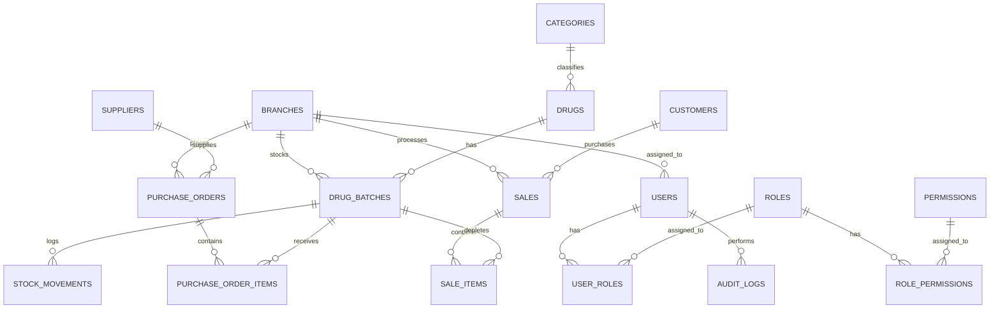

# 🏥 Pharmacy Management System (PMS)
## Complete Architecture, Database Schema, API & Implementation Specification

---

## 1. Executive Summary & Core Objectives

The **Pharmacy Management System (PMS)** is an enterprise-grade web application built with **Spring Boot 3.3.x (Java 17)** and **Angular 18 (Standalone & Signals)**. It supports retail pharmacies, wholesale pharmaceutical distributors, and hybrid operations.

### Key Capabilities:
- **FEFO (First-Expiry-First-Out) Inventory Engine**: Automatically prioritizes dispensing drug batches with the nearest expiry dates to eliminate wastage.
- **Single Source of Truth Stock Ledger (`stock_movements`)**: Immutable transaction logs for every pill received, sold, returned, or written off.
- **High-Speed Point of Sale (POS)**: Barcode-driven terminal with keyboard shortcuts, split payments, customer credit accounts, and optimistic locking to prevent overselling.
- **Multi-Tier Dynamic Pricing**: Automatically applies Retail, Wholesale, or Distributor pricing tiers depending on customer profile.
- **Procurement & Goods Received Note (GRN)**: Full Purchase Order workflow from pharmaceutical suppliers with batch intake and payment term tracking.
- **Dual Printing Engine**:
  - **Thermal Receipt (58mm / 80mm)**: Compact slip with cashier info, itemization, and verification QR/barcode.
  - **A4 Wholesale Invoice**: Tax breakdown, business letterhead, license number, terms, and signature lines.
- **Real-Time Alerts & Schedulers**: Automated cron job for batches expiring in 30/60/90 days and real-time WebSocket push for stock-outs and admin broadcasts.
- **Financial Analytics & P&L**: Exact profit calculation derived from $\sum (\text{Selling Price} - \text{Cost Price at Sale})$, dead stock detection, and stock valuation.
- **Dynamic Granular RBAC**: Fine-grained permissions allowing new roles (Branch Manager, Wholesale Rep, Inventory Officer) without code changes.

---

## 2. System Architecture & Component Diagram

```
+-------------------------------------------------------------------------+
|                       ANGULAR 18 CLIENT LAYER                           |
|  - Standalone Components & Signal-based Reactivity                      |
|  - Domain-Driven Architecture (Auth, Dashboard, POS, Inventory, Admin)  |
|  - Route Guards & JWT Bearer Interceptors                               |
|  - Fast POS Terminal + CSS @media Thermal / A4 Print Engine             |
|  - Real-Time STOMP / WebSocket Alert Subscriptions                      |
|  - Reusable UI Components (DataTable, Modals, Badges, Confirm Dialogs)  |
+-------------------------------------------------------------------------+
                                    │  HTTPS / REST / WSS
                                    ▼
+-------------------------------------------------------------------------+
|                    SPRING BOOT 3.3 REST API LAYER                       |
|  - Spring Security 6 + Stateless JWT Auth (jjwt 0.12.x)                 |
|  - Dynamic Role-Based Access Control (@PreAuthorize)                    |
|  - Unified ApiResponse<T> & PageResponse<T> Envelopes                   |
|  - Spring Data JPA + Hibernate (Optimistic Locking with @Version)       |
|  - FEFO Allocation & Stock Movement Ledger Engine                       |
|  - OpenPDF (PDF Invoices & Reports) & Apache POI (Excel Exports)        |
|  - Quartz / Spring Scheduling for Expiry & Reorder Scanners             |
|  - Spring WebSocket with STOMP message broker                           |
|  - OpenAPI 3.0 / Swagger UI Interactive Documentation                   |
+-------------------------------------------------------------------------+
                                    │  JDBC (HikariCP)
                                    ▼
+-------------------------------------------------------------------------+
|                             DATABASE LAYER                              |
|  - PostgreSQL / MySQL (Production) or H2 (Development & Testing)        |
|  - Flyway Database Migration Scripts (V1__... V4__...)                  |
+-------------------------------------------------------------------------+
```

---

## 3. Database Schema & Data Dictionary



### Table Definitions:

#### 1. `users`
- `id` (BIGINT, PK, Auto-increment)
- `username` (VARCHAR(50), Unique, Not Null)
- `email` (VARCHAR(100), Unique, Not Null)
- `password_hash` (VARCHAR(255), Not Null)
- `first_name` (VARCHAR(50), Not Null)
- `last_name` (VARCHAR(50), Not Null)
- `phone` (VARCHAR(20))
- `branch_id` (BIGINT, FK -> branches.id)
- `is_active` (BOOLEAN, Default TRUE)
- `created_at` (TIMESTAMP), `updated_at` (TIMESTAMP)

#### 2. `roles` & `permissions` & `role_permissions`
- `roles`: `id`, `name` (`ROLE_OWNER`, `ROLE_PHARMACIST`, `ROLE_CASHIER`), `description`
- `permissions`: `id`, `code` (`DRUG_READ`, `DRUG_CREATE`, `BATCH_MANAGE`, `POS_CHECKOUT`, `REPORT_PROFIT_VIEW`, `USER_MANAGE`)
- `role_permissions`: `role_id`, `permission_id`

#### 3. `branches`
- `id` (BIGINT, PK)
- `name` (VARCHAR(100), Not Null)
- `code` (VARCHAR(20), Unique)
- `address` (TEXT), `phone` (VARCHAR(30)), `license_number` (VARCHAR(50))
- `is_main_warehouse` (BOOLEAN, Default FALSE)

#### 4. `categories`
- `id` (BIGINT, PK)
- `name` (VARCHAR(100), Unique, Not Null) - e.g., Antibiotics, Analgesics, Antihypertensives, Syrups
- `description` (TEXT)

#### 5. `drugs`
- `id` (BIGINT, PK)
- `name` (VARCHAR(150), Not Null) - e.g., "Amoxil 500mg"
- `generic_name` (VARCHAR(150), Not Null) - e.g., "Amoxicillin Trihydrate"
- `category_id` (BIGINT, FK -> categories.id)
- `dosage_form` (VARCHAR(50)) - TABLET, CAPSULE, SYRUP, INJECTION, OINTMENT, DROPS
- `strength` (VARCHAR(50)) - e.g., "500mg", "100ml"
- `unit_of_measure` (VARCHAR(30)) - BOX, STRIP, BOTTLE, VIAL
- `barcode` (VARCHAR(100), Unique, Indexed)
- `reorder_threshold` (INT, Default 20)
- `is_prescription_required` (BOOLEAN, Default FALSE)
- `status` (VARCHAR(20), Default 'ACTIVE')

#### 6. `drug_batches` (FEFO Core Table)
- `id` (BIGINT, PK)
- `drug_id` (BIGINT, FK -> drugs.id, Not Null)
- `branch_id` (BIGINT, FK -> branches.id, Not Null)
- `supplier_id` (BIGINT, FK -> suppliers.id)
- `batch_number` (VARCHAR(50), Not Null)
- `expiry_date` (DATE, Not Null, Indexed for FEFO sorting)
- `manufacturing_date` (DATE)
- `quantity_on_hand` (INT, Not Null, Check $\ge 0$)
- `buying_price` (DECIMAL(12,2), Not Null)
- `retail_price` (DECIMAL(12,2), Not Null)
- `wholesale_price` (DECIMAL(12,2))
- `distributor_price` (DECIMAL(12,2))
- `version` (BIGINT, Default 0) -> JPA `@Version` for optimistic concurrency locking

#### 7. `stock_movements` (Single Source of Truth Ledger)
- `id` (BIGINT, PK)
- `drug_batch_id` (BIGINT, FK -> drug_batches.id, Not Null)
- `branch_id` (BIGINT, FK -> branches.id)
- `user_id` (BIGINT, FK -> users.id)
- `movement_type` (VARCHAR(30)) - PURCHASE_RECEIPT, SALE, SALE_RETURN, PURCHASE_RETURN, DAMAGE_WRITE_OFF, EXPIRY_WRITE_OFF, TRANSFER_IN, TRANSFER_OUT, ADJUSTMENT
- `quantity_delta` (INT, Not Null) - Positive (+) for stock-in, Negative (-) for stock-out
- `reference_type` (VARCHAR(50)) - 'SALE', 'PURCHASE_ORDER', 'ADJUSTMENT_MEMO'
- `reference_id` (BIGINT)
- `reason` (TEXT)
- `created_at` (TIMESTAMP, Default CURRENT_TIMESTAMP)

#### 8. `suppliers`
- `id` (BIGINT, PK)
- `name` (VARCHAR(150), Not Null)
- `contact_person` (VARCHAR(100)), `phone` (VARCHAR(30)), `email` (VARCHAR(100))
- `tax_number` (VARCHAR(50)), `address` (TEXT), `payment_terms_days` (INT, Default 30)

#### 9. `purchase_orders` & `purchase_order_items`
- `purchase_orders`: `id`, `po_number`, `supplier_id`, `branch_id`, `order_date`, `status` (DRAFT, ORDERED, RECEIVED, CANCELLED), `total_amount`, `paid_amount`, `notes`
- `purchase_order_items`: `id`, `purchase_order_id`, `drug_id`, `batch_number`, `expiry_date`, `quantity_ordered`, `quantity_received`, `unit_cost`, `subtotal`

#### 10. `customers`
- `id` (BIGINT, PK)
- `name` (VARCHAR(150), Not Null)
- `phone` (VARCHAR(30)), `email` (VARCHAR(100)), `tax_number` (VARCHAR(50))
- `customer_type` (VARCHAR(30)) - RETAIL, WHOLESALE, DISTRIBUTOR
- `credit_limit` (DECIMAL(12,2), Default 0.00)
- `current_balance` (DECIMAL(12,2), Default 0.00)

#### 11. `sales` & `sale_items`
- `sales`:
  - `id` (BIGINT, PK)
  - `invoice_number` (VARCHAR(50), Unique, Indexed)
  - `customer_id` (BIGINT, FK -> customers.id, Nullable for retail walk-ins)
  - `branch_id` (BIGINT, FK -> branches.id)
  - `cashier_id` (BIGINT, FK -> users.id, Not Null)
  - `sale_type` (VARCHAR(30)) - RETAIL, WHOLESALE, DISTRIBUTOR
  - `subtotal` (DECIMAL(12,2), Not Null)
  - `discount_amount` (DECIMAL(12,2), Default 0.00)
  - `tax_amount` (DECIMAL(12,2), Default 0.00)
  - `grand_total` (DECIMAL(12,2), Not Null)
  - `paid_amount` (DECIMAL(12,2), Not Null)
  - `change_amount` (DECIMAL(12,2), Default 0.00)
  - `payment_method` (VARCHAR(30)) - CASH, CARD, MOBILE_MONEY, CREDIT_ACCOUNT
  - `prescription_number` (VARCHAR(50))
  - `doctor_name` (VARCHAR(100))
  - `created_at` (TIMESTAMP, Default CURRENT_TIMESTAMP)
- `sale_items`:
  - `id` (BIGINT, PK)
  - `sale_id` (BIGINT, FK -> sales.id)
  - `drug_batch_id` (BIGINT, FK -> drug_batches.id)
  - `quantity` (INT, Not Null)
  - `unit_price` (DECIMAL(12,2), Not Null)
  - `cost_price_at_sale` (DECIMAL(12,2), Not Null) -> Stores exact cost to compute true gross profit
  - `discount_amount` (DECIMAL(12,2), Default 0.00)
  - `subtotal` (DECIMAL(12,2), Not Null)

#### 12. `announcements` & `notifications`
- `id` (BIGINT, PK)
- `title` (VARCHAR(150), Not Null), `message` (TEXT, Not Null)
- `type` (VARCHAR(30)) - LOW_STOCK, EXPIRY_WARNING, SYSTEM_ALERT, BROADCAST
- `priority` (VARCHAR(20)) - LOW, MEDIUM, HIGH, CRITICAL
- `is_read` (BOOLEAN, Default FALSE), `created_at` (TIMESTAMP)

#### 13. `audit_logs`
- `id` (BIGINT, PK)
- `user_id` (BIGINT, FK -> users.id)
- `action` (VARCHAR(100)) - e.g. "DRUG_CREATED", "STOCK_ADJUSTED", "SALE_VOIDED"
- `entity_name` (VARCHAR(50)), `entity_id` (VARCHAR(50))
- `details_json` (TEXT)
- `ip_address` (VARCHAR(50))
- `created_at` (TIMESTAMP)

---

## 4. REST API Endpoint Catalog

All responses follow the unified envelope:
```json
{
  "success": true,
  "message": "Operation successful",
  "data": { ... },
  "timestamp": "2026-09-16T17:00:00"
}
```

### Authentication (`/api/v1/auth`)
| Method | Endpoint | Description | Auth Required |
|---|---|---|---|
| `POST` | `/api/v1/auth/login` | Authenticate user & return JWT token + permissions | No |
| `GET` | `/api/v1/auth/me` | Fetch currently logged-in user profile & permissions | Yes |
| `POST` | `/api/v1/auth/change-password` | Update current user password | Yes |

### Inventory & Drug Catalog (`/api/v1/drugs`, `/api/v1/batches`, `/api/v1/inventory`)
| Method | Endpoint | Description | Required Permission |
|---|---|---|---|
| `GET` | `/api/v1/drugs` | List drugs (paginated, searchable by name/barcode/category) | `DRUG_READ` |
| `POST` | `/api/v1/drugs` | Create new drug master profile | `DRUG_CREATE` |
| `PUT` | `/api/v1/drugs/{id}` | Update drug details & threshold | `DRUG_EDIT` |
| `GET` | `/api/v1/drugs/barcode/{barcode}` | Quick lookup by barcode scanner | `DRUG_READ` |
| `GET` | `/api/v1/batches` | List active batches with FEFO sorting & expiry status | `BATCH_READ` |
| `POST` | `/api/v1/batches` | Register or restock a drug batch manually | `BATCH_MANAGE` |
| `POST` | `/api/v1/inventory/adjust` | Record stock damage/loss write-off with audit reason | `INVENTORY_ADJUST` |
| `GET` | `/api/v1/inventory/movements` | Query immutable stock ledger movements | `INVENTORY_AUDIT` |

### Point of Sale (POS) & Checkout (`/api/v1/pos`)
| Method | Endpoint | Description | Required Permission |
|---|---|---|---|
| `GET` | `/api/v1/pos/search` | Fast drug search for POS cart (with FEFO stock check) | `POS_ACCESS` |
| `POST` | `/api/v1/pos/checkout` | Process sale, auto-deduct FEFO batches, generate invoice | `SALE_CREATE` |
| `GET` | `/api/v1/pos/receipt/{invoiceNo}` | Fetch printable thermal / A4 receipt metadata | `SALE_READ` |

### Procurement & Purchases (`/api/v1/purchases`, `/api/v1/suppliers`)
| Method | Endpoint | Description | Required Permission |
|---|---|---|---|
| `GET` | `/api/v1/suppliers` | List suppliers & payment terms | `SUPPLIER_READ` |
| `POST` | `/api/v1/suppliers` | Create supplier profile | `SUPPLIER_MANAGE` |
| `GET` | `/api/v1/purchases` | List purchase orders | `PURCHASE_READ` |
| `POST` | `/api/v1/purchases` | Create Purchase Order (PO) | `PURCHASE_CREATE` |
| `POST` | `/api/v1/purchases/{id}/receive` | Record Goods Received (GRN) -> increments batch stock | `PURCHASE_RECEIVE` |

### Reports, Analytics & Dashboard (`/api/v1/reports`, `/api/v1/dashboard`)
| Method | Endpoint | Description | Required Permission |
|---|---|---|---|
| `GET` | `/api/v1/dashboard/summary` | Today's revenue, profit, low-stock count, expiring count | `DASHBOARD_VIEW` |
| `GET` | `/api/v1/reports/profit-loss` | P&L breakdown by date range (Revenue vs COGS vs Profit) | `REPORT_PROFIT_VIEW` |
| `GET` | `/api/v1/reports/stock-valuation` | Total inventory valuation (Wholesale & Retail worth) | `REPORT_INVENTORY_VIEW` |
| `GET` | `/api/v1/reports/expiry` | Batches expiring within 30 / 60 / 90 days | `REPORT_EXPIRY_VIEW` |
| `GET` | `/api/v1/reports/export/excel` | Export tabular reports as `.xlsx` | `REPORT_EXPORT` |
| `GET` | `/api/v1/reports/export/pdf` | Export executive reports as `.pdf` | `REPORT_EXPORT` |

### Notifications & WebSocket (`/api/v1/notifications`, `/ws/pms`)
| Method | Endpoint | Description | Required Permission |
|---|---|---|---|
| `GET` | `/api/v1/notifications` | Fetch unread system & stock alert notifications | `NOTIF_READ` |
| `POST` | `/api/v1/notifications/broadcast` | Owner broadcasts announcements to staff | `NOTIF_BROADCAST` |
| `WS` | `/ws/pms` (STOMP) | Topic `/topic/alerts` for live stock-out & expiry push | Authenticated |

---

## 5. Code Directory Architecture

### Backend (`pms-backend`)
```
com.pharmacy.pms/
 ├── config/           # SecurityConfig, CorsConfig, JwtConfig, OpenApiConfig, WebSocketConfig
 ├── controller/       # REST controllers returning ApiResponse<T>
 ├── dto/              # request/*.java, response/*.java
 ├── exception/        # GlobalExceptionHandler, Custom Exceptions
 ├── model/
 │    ├── entity/      # JPA Entities (BaseEntity, User, Drug, DrugBatch, StockMovement, Sale, etc.)
 │    └── enums/       # Enums (UserRole, DosageForm, MovementType, CustomerType, PaymentMethod)
 ├── repository/       # Spring Data JPA Repositories
 ├── security/         # PmsUserPrincipal, JwtTokenProvider, JwtAuthenticationFilter
 └── service/          # Business logic services & interfaces
```

### Frontend (`pms-frontend`)
```
src/app/
 ├── core/
 │    ├── auth/        # guards/ (auth, role), interceptors/ (jwt, error), services/ (auth.service)
 │    ├── services/    # api.service, print.service, websocket.service, theme.service
 │    └── tokens/      # api-config token
 ├── domains/
 │    ├── auth/        # Login page & forgot password
 │    ├── shell/       # Sidebar, Topbar, Notifications drawer layout
 │    ├── dashboard/   # KPI metrics, Revenue/Profit trend charts, Low-stock widgets
 │    ├── pos/         # POS terminal, fast barcode scanner, payment modal, thermal receipt
 │    ├── inventory/   # Drug catalog, Batch manager (FEFO badges), Stock movement ledger
 │    ├── purchases/   # Purchase Orders, Supplier directory, GRN receiving modal
 │    ├── sales/       # Sales history, A4 invoice viewer & reprint
 │    ├── customers/   # Retail, Wholesale & Distributor profiles, Credit balances
 │    ├── reports/     # P&L, Inventory valuation, Expiry report, Excel/PDF exports
 │    └── admin/       # User accounts, Role-permission matrix, Audit logs
 └── shared/
      ├── ui/          # data-table, modal, badge, button, stats-card, confirm-dialog
      ├── pipes/       # currency-format, expiry-status, time-ago
      └── services/    # notification.service (toasts & alerts), modal.service
```

---

## 6. Implementation Phasing

1. **Phase 1**: Project Scaffolding, Database setup & JWT/RBAC Security
2. **Phase 2**: Master Data, Drug Catalog & FEFO Batch Inventory Engine
3. **Phase 3**: Procurement & Supplier Management (PO & GRN)
4. **Phase 4**: Point of Sale (POS) Terminal & Multi-Tier Pricing Engine
5. **Phase 5**: Thermal (58mm/80mm) & A4 Wholesale Invoice Printing
6. **Phase 6**: Automated Expiry/Stock Schedulers & Live WebSocket Alerts
7. **Phase 7**: Financial Profit & Loss Reports, Inventory Valuation & Audit Logs

---
